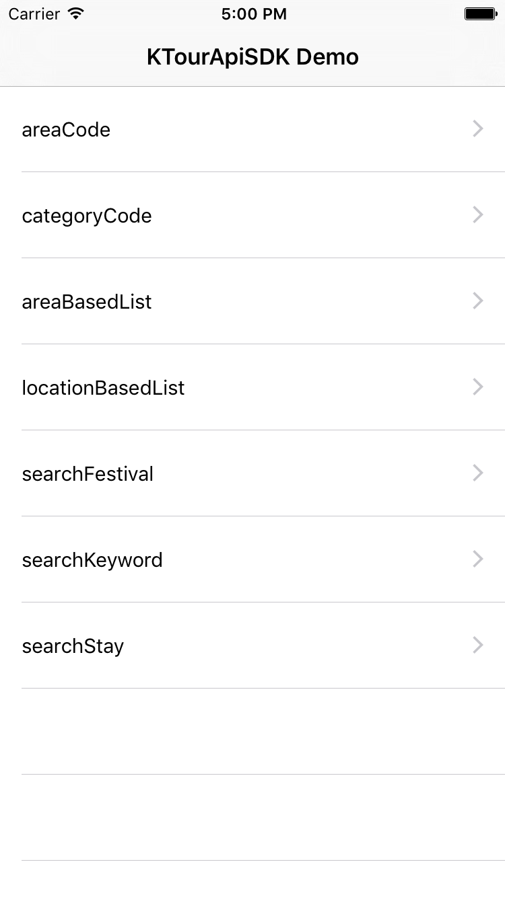
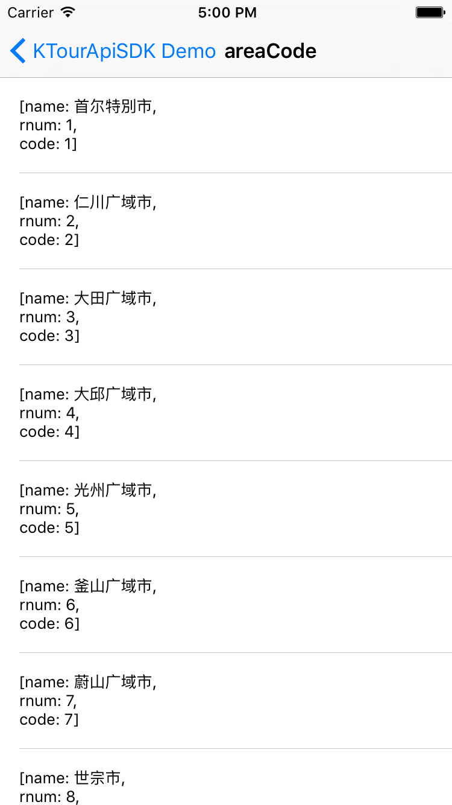
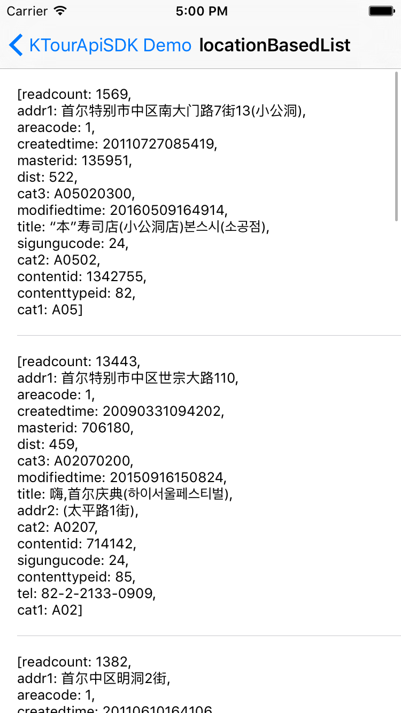
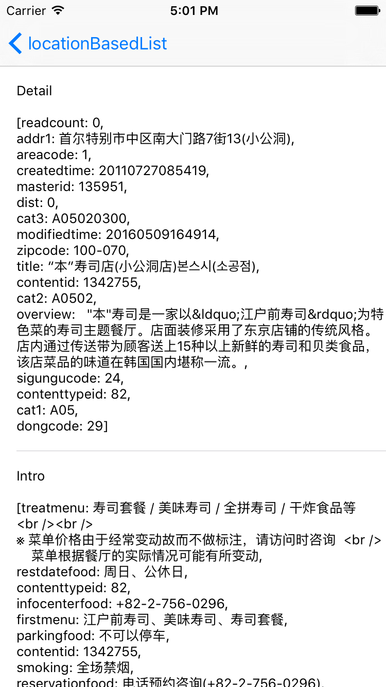

# KTourApi-iOS-SDK

[](https://travis-ci.org/Steve Kim/KTourApiSDK)
[](http://cocoapods.org/pods/KTourApiSDK)
[](http://cocoapods.org/pods/KTourApiSDK)
[](http://cocoapods.org/pods/KTourApiSDK)

## Example

To run the example project, clone the repo, and run `pod install` from the Example directory first.

<div>


</div>
<br/>
<div>


</div>

#### Info.plist

Add or replace node below to you app info plist.

```XML
<key>KTourApiServiceKey</key>
<string>Your Service Key</string>
<key>NSAppTransportSecurity</key>
<dict>
	<key>NSExceptionDomains</key>
	<dict>
		<key>visitkorea.or.kr</key>
		<dict>
			<key>NSIncludesSubdomains</key>
			<true/>
			<key>NSTemporaryExceptionAllowsInsecureHTTPLoads</key>
			<true/>
			<key>NSThirdPartyExceptionMinimumTLSVersion</key>
			<string>TLSv1.1</string>
			<key>NSThirdPartyExceptionRequiresForwardSecrecy</key>
			<false/>
		</dict>
	</dict>
</dict>
```

#### Example for API Call
```swift
KTourApiAppCenter.defaultCenter().call(
    path: KTourApiPath.LocationBasedList,
    params: KTourApiParameterSet.LocationBasedList(numOfRows: 10, pageNo: 1, contentTypeId: nil, mapX: 126.981611, mapY: 37.568477),
    completion: {(result: KTourApiResult<KTourApiResultItem.POI>?, error:NSError?) -> Void in
    	print("result, error ->", result?.description, error?.description)
})
```

#### API Paths
```swift
public enum KTourApiPath: String {
    case
    AreaCode            = "areaCode",
    AreaBasedList       = "areaBasedList",
    CategoryCode        = "categoryCode",
    DetailCommon        = "detailCommon",
    DetailImage         = "detailImage",
    DetailInfo          = "detailInfo",
    DetailIntro         = "detailIntro",
    LocationBasedList   = "locationBasedList",
    SearchFestival      = "searchFestival",
    SearchKeyword       = "searchKeyword",
    SearchStay          = "searchStay"
}
```

#### Change Language Type
```swift
KTourApiAppCenter.defaultCenter().languageType = KTourApiLanguageType.Chs

public enum KTourApiLanguageType: String {
    case
    Chs = "ChsService",
    Cht = "ChtService",
    Eng = "EngService",
    Ger = "GerService",
    Fre = "FreService",
    Jpn = "JpnService",
    Rus = "RusService",
    Spn = "SpnService"
}
```

## Requirements
iOS Deployment Target 8.0 higher

## Installation

KTourApiSDK is available through [CocoaPods](http://cocoapods.org). To install
it, simply add the following line to your Podfile:

```ruby
pod "KTourApiSDK"
```

## Author

Steve Kim, hh963103@gmail.com

## License

KTourApiSDK is available under the MIT license. See the LICENSE file for more info.
